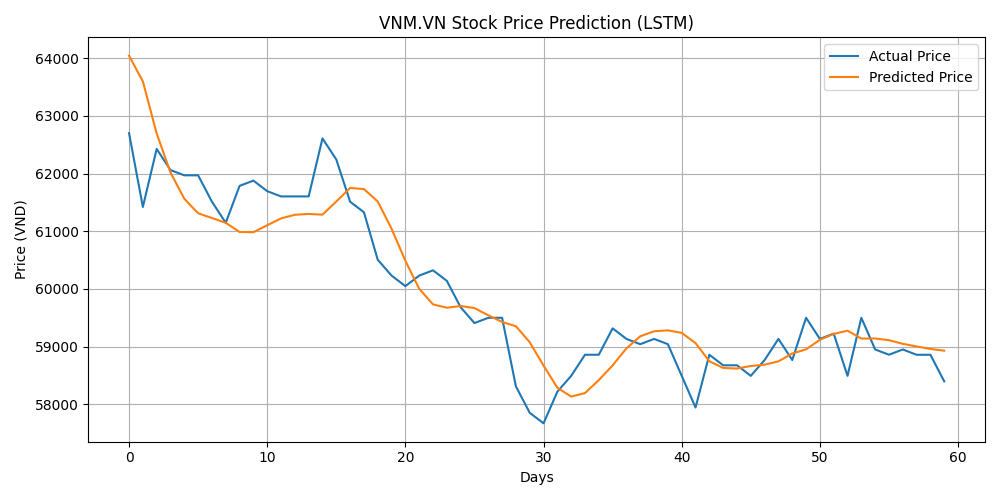

# 🧠 Stock Price Prediction using LSTM

This project builds a deep learning model to predict stock closing prices based on historical data.

## 🚀 Features
- Data fetched from Yahoo Finance (VN stocks)
- Preprocessing with feature scaling and sequence generation
- LSTM model built in PyTorch
- Visualization of true vs predicted prices

## 📊 Example Result

## 🧰 Tech Stack
- Python, PyTorch, Pandas, Scikit-learn
- Matplotlib, yfinance

## 🧑‍💻 Author
Phạm Ngọc Hoà — Quantitative Research Intern Candidate
